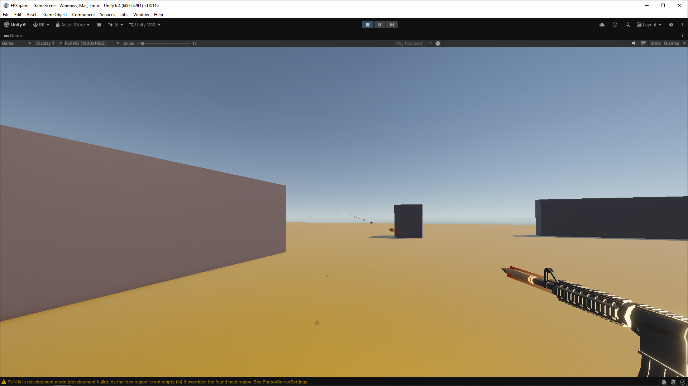

# FPS-game

This is an online multiplayer First-Person-Shooting game. Players / Friends can join each other through room system where a certain chosen room id has to be selected by both party to join the game. The main mission of the game is Free For All shooting, leaderboard. I have featured walls and cube blocks across 4 spawnpoint along with diagonal cube (between walls) for agressive rushers. 

The center block has an AR with double magazine capacity, double the rate of fire which improves the firepower but poses significant risk to obtain it. 

# Some Controls

**Tab:** Player can view their kill / death stats
**Q:** Drop weapon
**E:** Equip new weapon (old weapon is dropped automatically)
**WASD:** Forward / Backward / Left /Right
**Space:** Jump 

# Assets

I've used free Low Poly FPS weapons lite (for Glock and AR) from unity assetstore. (https://assetstore.unity.com/packages/3d/props/guns/low-poly-fps-weapons-lite-245929)

# Use Of AI

Claude helped me understand how other FPS games uses Hitscan. I realized that using physical bullets, managing the accuracy with crosshair due to bulletspawn point being in right hand side (as the side holding gun) was very complicated. Then, it recommended hitscan for me and also helped me with hitscan script. PlayerRespawn also did not worked as I intended so I took help on that as well. Other than that, I've only used VS code's autocomplete in few cases. 

# Extras

**Before:** image of how bullets were during physical bullet damage logic. 

